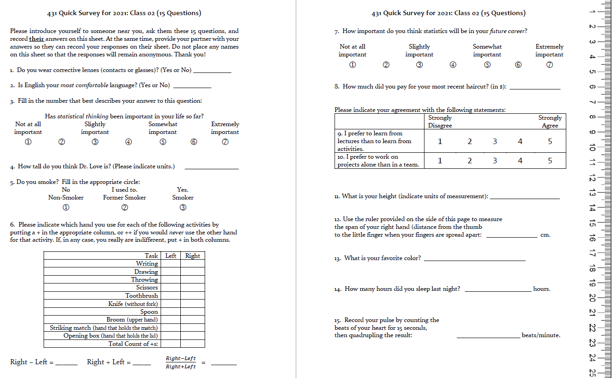
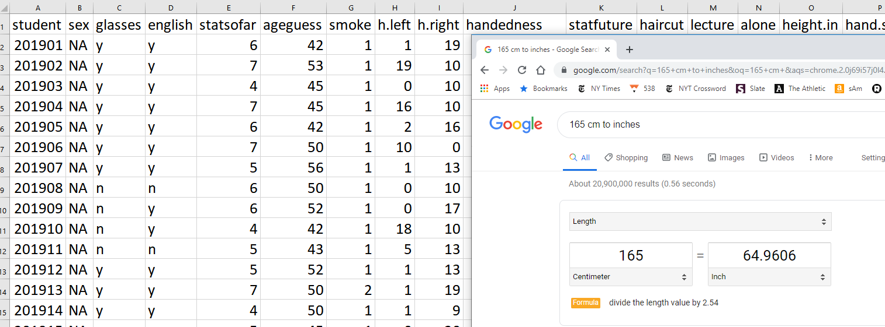
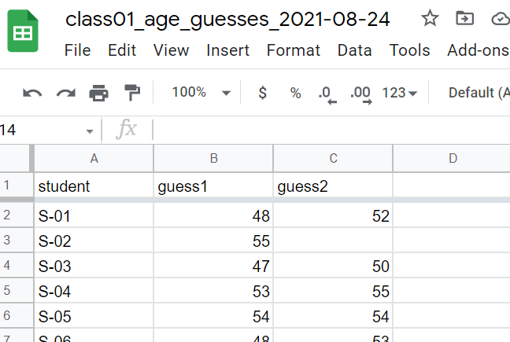

```{r setup, include=FALSE}
knitr::opts_chunk$set(comment=NA)
options(width = 55)
```

## Instructions for the Quick Survey

Please read these instructions carefully before writing anything down.

1. Introduce yourself to someone that you don't know.
2. Record the survey answers **for that other person**, while they record your responses.
3. Be sure to complete all 15 questions (both sides of the paper).
4. When you are finished, thank your partner and raise your hand. Someone will come to collect your survey.

Regarding Question 4 on the Quick Survey, Professor Love is the large fellow standing in the front of the room.

## Today's Agenda

- Data Structures and Variables
- Evaluating some of the Survey variables
- Using R to look at a little data
- Guessing Dr. Love's Age

## Class 03 will be a Pre-Recorded Demonstration

We won't meet as a group for Class 03. Instead, I will provide a recording of myself using R and R Studio to:

- create a Project in RStudio
- create an R Markdown document to obtain and describe results
- ingest a data set from the wild into an R data frame
- manage that data frame so that it becomes a tidy tibble
- use that tibble to learn about the data by iterating through
  - visualizing the data
  - transforming the data
  - modeling the data (with a few simple summaries)
- interspersing code and text in my R Markdown document
- "knitting" my R Markdown document into an attractive HTML result

All materials will be posted as soon as possible to the Class 03 page.

## Today's Package Loading

```{r, message = FALSE}
library(janitor)
library(googlesheets4)
library(patchwork)
library(tidyverse)
```

If you actually run this, you will get some messages which we will suppress and ignore today.

# Thinking about The Quick Survey

## Chatfield's Six Rules for Data Analysis

1. Do not attempt to analyze the data until you understand what is being measured and why.
2. Find out how the data were collected.
3. Look at the structure of the data.
4. Carefully examine the data in an exploratory way, before attempting a more sophisticated analysis.
5. Use your common sense at all times.
6. Report the results in a clear, self-explanatory way.

Chatfield, Chris (1996) *Problem Solving: A Statistician's Guide*, 2nd ed.

## Types of Data

Data can be **quantitative (numerical)** or **qualitative (categorical)**

- **Quantitative**
    + Variables recorded in numbers that we use as numbers.
    + All quantitative variables must have units of measurement.
    + Can break into *continuous* (may take any value in a range) or *discrete* (limited set of potential values.)
        - Height is certainly continuous as a concept, but how precise is our ruler?
        - Piano vs. Violin
    + (less common) *interval* (equal distances between values, but zero point is arbitrary) as compared to *ratio* variables (a meaningful zero point.)
        - Is *weight* an interval or ratio variable? How about *IQ*?
    + Taking a mean or median is a reasonable idea.

## Types of Data 

Data can be **quantitative (numerical)** or **qualitative (categorical)**

- Qualitative 
    + Variables consisting of names of categories.
    + Each possible value is a code for a category (could use numerical or non-numerical codes.)
        + *Binary* categorical variables (two categories, often labeled 1 or 0)
        + *Multi-categorical* variables (usually taken to be 3+ categories)
    + Also, *nominal* (no underlying order) or *ordinal* (categories are ordered.)
        - How is your overall health? (Excellent, Very Good, Good, Fair, Poor)
        - Which candidate would you vote for if the election were held today?
        - Did this patient receive this procedure?

## Our Quick Survey



## Evaluating Some Quick Survey variables

1. Do you **smoke**? (1 = Non-Smoker, 2 = Former Smoker, 3 = Smoker)
2. How much did you pay for your most recent **haircut**? (in $)
3. What is your favorite **color**?
4. How many hours did you **sleep** last night?
5. Statistical thinking in your future **career**? (1 = Not at all important to 7 = Extremely important)

### Are these quantitative or qualitative?

- If quantitative, are they *discrete* or *continuous*? Do they have a meaningful *zero point*?
- If qualitative, how many categories? *Nominal* or *ordinal*?

## Importing and Tidying Data


## Ingesting the Quick Surveys



## The Quick Survey

315 people before you have taken (essentially) this same survey in the same way.

Fall | 2019 | 2018 | 2017 | 2016 | 2015 | 2014 | Total
----: | ----: |----: | ----: | ----: | ----: | -----: | -----:
*n* | 61 | 51 | 48 | 64 | 49 | 42 | **315**

### Question

About how many of those 315 surveys caused *no problems* in recording responses?

## The 15 Survey Items

\#  | Topic         | \#  | Topic
--: | -----------   | --: | -----------
Q1 | `glasses`      | Q9  | `lectures_vs_activities`
Q2 | `english`      | Q10 | `projects_alone`
Q3 | `stats_so_far` | Q11 | `height`
Q4 | `guess_TL_ht`  | Q12 | `hand_span`
Q5 | `smoke`        | Q13 | `color`
Q6 | `handedness`   | Q14 | `sleep`
Q7 | `stats_future` | Q15 | `pulse_rate`
Q8 | `haircut`      | -   | -


- At one time, I asked about `sex` rather than `glasses`.
- In prior years, people guessed my age, rather than height here.
- Sometimes, I've asked for a 30-second pulse check, then doubled.

## Response to the Question I asked

About how many of those 315 surveys caused *no problems* in recording responses?

> - Guesses?

> - 110/315 (35%) caused no problems.

## Guess My Age

 


What should we do in these cases?

## English best language?

 


## Height


## Handedness Scale (2016-21 version)


## Favorite color


## Following the Rules?


### 2019 `pulse` responses, sorted (*n* = 61, 1 NA)

```
 33 46 48  56  60  60    3 | 3
 62 63 65  65  66  66    4 | 68
 68 68 68  69  70  70    5 | 6
 70 70 70  70  70  70    6 | 002355668889        
 71 72 72  74  74  74    7 | 00000000122444445666888
 74 74 75  76  76  76    8 | 000012445668
 78 78 78  80  80  80    9 | 000046
 80 81 82  84  84  85   10 | 44
 86 86 88  90  90  90   11 | 0
 90 94 96 104 104 110 
```

## Stem and Leaf: Pulse Rates, 2014-2019 


(Thanks, John \color{red} **Tukey** \color{black})

## Garbage in, garbage out ...


# Guessing My Age (from Class 01)

## From our Shared Google Drive

I've placed a Google Sheet called `class01_age_guesses_2021-08-24` on our Shared Google Drive. Remember that you have to log into Google via CWRU to see the Drive I've shared with you.

```{r, echo = FALSE, out.height = "50%", fig.align = "center"}

```

## Reading from our Shared Google Drive

We'll use the `read_sheet` function from the `googlesheets4` package to read in data from a Google Sheet. My first step is to copy the URL from the Google Sheet into a temporary object I'll call `temp_url`.

```{r, message = FALSE}
temp_url <- "https://docs.google.com/spreadsheets/d/1Mgu_Xj0A8F9d4hLIv4nyQ5XlgbYGH7fSKR8ynlQ4qbc/edit#gid=0"
```

Then I'll ask R to read in the data from the sheet to a new data frame (technically a tibble) called `age_guess`.

```{r, message = FALSE}
age_guess <- read_sheet(temp_url)
```

When you do this the first time, R will ask you to verify some things in the browser and allow the browser to pull down the sheet. Let it do so.

## What is in the `age_guess` data frame?

```{r}
age_guess
```

## What do the `guess1` values look like?

```{r}
age_guess %>% select(guess1) %>% arrange(guess1)
```


## Plot the `guess1` values?

```{r}
ggplot(age_guess, aes(x = guess1)) +
  geom_dotplot(binwidth = 1)
```

## Can we make a histogram?

```{r, fig.height = 4}
ggplot(age_guess, aes(x = guess1)) +
  geom_histogram()
```

## Improving the Histogram, 1

```{r}
ggplot(age_guess, aes(x = guess1)) +
  geom_histogram(bins = 10) 
```

## Improving the Histogram, 2

```{r}
ggplot(age_guess, aes(x = guess1)) +
  geom_histogram(bins = 10, col = "yellow")
```

## Improving the Histogram, 3

```{r}
ggplot(age_guess, aes(x = guess1)) +
  geom_histogram(bins = 10, col = "white", fill = "blue")
```

## Improving the Histogram, 4 (code only)

```{r, eval = FALSE}
ggplot(age_guess, aes(x = guess1)) +
  geom_histogram(bins = 15, col = "white", fill = "blue") +
  theme_bw()
```

- We've changed the theme to `theme_bw`
- We've increased the number of bins from 10 to 15.

Results of Version 3 and Version 4 shown on the next slide.

## Results for Versions 3 and 4

```{r, echo = FALSE}
p3 <- ggplot(age_guess, aes(x = guess1)) +
  geom_histogram(bins = 10, col = "white", fill = "blue") + 
  labs(title = "Version 3 (10 bins and default theme)")

p4 <- ggplot(age_guess, aes(x = guess1)) +
  geom_histogram(bins = 15, col = "white", fill = "blue") +
  theme_bw() +
  labs(title = "Version 4 (15 bins, and theme_bw()")

p3 / p4
```


## Improving the Histogram, 5 (code only)

```{r, eval = FALSE}
ggplot(age_guess, aes(x = guess1)) +
  geom_histogram(bins = 15, col = "white", fill = "blue") +
  theme_bw() +
  labs(x = "First Guess of Dr. Love's Age (in years)",
       y = "Number of Fall 2021 431 students")
```

Here we add axis labels. Result on next slide.

## Results of Version 5

```{r, echo = FALSE}
ggplot(age_guess, aes(x = guess1)) +
  geom_histogram(bins = 15, col = "white", fill = "blue") +
  theme_bw() +
  labs(x = "First Guess of Dr. Love's Age (in years)",
       y = "Number of Fall 2021 431 students")
```


## Version 6 adds title and subtitle

```{r, eval = FALSE}
ggplot(age_guess, aes(x = guess1)) +
  geom_histogram(bins = 15, col = "white", fill = "blue") +
  theme_bw() +
  labs(x = "First Guess of Dr. Love's Age (in years)",
       y = "Number of Fall 2021 431 students",
       title = "Most First Guesses were pretty close",
       subtitle = "Dr. Love's actual age was 54.5")
```

## Result of Version 6 code

```{r, echo = FALSE}
ggplot(age_guess, aes(x = guess1)) +
  geom_histogram(bins = 15, col = "white", fill = "blue") +
  theme_bw() +
  labs(x = "First Guess of Dr. Love's Age (in years)",
       y = "Number of Fall 2021 431 students",
       title = "Most First Guesses were pretty close",
       subtitle = "Dr. Love's actual age was 54.5")
```

## Improving the Histogram, 7

Let's add a vertical line at 54.5 years to show my actual age.

```{r, eval = FALSE}
ggplot(age_guess, aes(x = guess1)) +
  geom_histogram(bins = 15, col = "white", fill = "blue") +
  geom_vline(aes(xintercept = 54.5), col = "red") +
  theme_bw() +
  labs(x = "First Guess of Dr. Love's Age (in years)",
       y = "Number of Fall 2021 431 students",
       title = "Most First Guesses were pretty close",
       subtitle = "Dr. Love's actual age was 54.5")
```

## Result from Improving the Histogram, 7

```{r, echo = FALSE}
ggplot(age_guess, aes(x = guess1)) +
  geom_histogram(bins = 15, col = "white", fill = "blue") +
  geom_vline(aes(xintercept = 54.5), col = "red") +
  theme_bw() +
  labs(x = "First Guess of Dr. Love's Age (in years)",
       y = "Number of Fall 2021 431 students",
       title = "Most First Guesses were pretty close",
       subtitle = "Dr. Love's actual age was 54.5")
```

## A Quick Numerical Summary of the Data Frame

```{r}
summary(age_guess)
```

>- Was the average guess closer to my actual age (54.5) on the first or second guess?
>- What was the range of first guesses? Second guesses?
>- What does the `NA's : 2` mean in `guess2`?
>- Why is `student` not summarized any further?

## Some additional summaries

```{r, message = FALSE}
mosaic::favstats(~ guess1, data = age_guess)

mosaic::favstats(~ guess2, data = age_guess)
```

## How many first guesses were between 53 and 56?

```{r}
age_guess %>% count(guess1 >= 53 & guess1 <= 56)
```

## How many second guesses were between 53 and 56?

```{r}
age_guess %>% count(guess2 >= 53 & guess1 <= 56)
```

## Comparing First Guess to Second Guess

Here's the code. Resulting scatterplot on next slide.

```{r, eval = FALSE}
ggplot(data = age_guess, aes(x = guess1, y = guess2)) +
  geom_point() + theme_bw()
```

## Comparing First Guess to Second Guess

```{r, echo = FALSE}
ggplot(data = age_guess, aes(x = guess1, y = guess2)) +
  geom_point() + theme_bw()
```


## Filter to complete cases, and add regression line

```{r, eval = FALSE}
age_guess %>%
  filter(complete.cases(guess1, guess2)) %>%
  ggplot(data = ., aes(x = guess1, y = guess2)) +
  geom_point() +
  geom_smooth(method = "lm", formula = y ~ x, 
              col = "purple")
```

## Resulting Scatterplot

```{r, echo = FALSE}
age_guess %>%
  filter(complete.cases(guess1, guess2)) %>%
  ggplot(data = ., aes(x = guess1, y = guess2)) +
  geom_point() +
  geom_smooth(method = "lm", formula = y ~ x, 
              col = "purple")
```

## What is that regression line?

```{r}
lm(guess2 ~ guess1, data = age_guess)
```

- Note that `lm` filters to complete cases by default.

## How about a loess smooth curve, instead?

```{r, eval = FALSE}
age_guess %>%
  filter(complete.cases(guess1, guess2)) %>%
  ggplot(data = ., aes(x = guess1, y = guess2)) +
  geom_point() +
  geom_smooth(method = "loess", formula = y ~ x,
              col = "blue") +
  theme_bw()
```

## Scatterplot with loess smooth

```{r, echo = FALSE}
age_guess %>%
  filter(complete.cases(guess1, guess2)) %>%
  ggplot(data = ., aes(x = guess1, y = guess2)) +
  geom_point() +
  geom_smooth(method = "loess", formula = y ~ x,
              col = "blue") +
  theme_bw()
```

## Add y = x line (no change in guess)?

```{r, eval = FALSE}
age_guess %>%
  filter(complete.cases(guess1, guess2)) %>%
  ggplot(data = ., aes(x = guess1, y = guess2)) +
  geom_point() +
  geom_smooth(method = "loess", formula = y ~ x,
              col = "blue") +
  geom_abline(intercept = 0, slope = 1, col = "red") +
  theme_bw()
```

## Blue smooth and Red line at y = x

```{r, echo = FALSE}
age_guess %>%
  filter(complete.cases(guess1, guess2)) %>%
  ggplot(data = ., aes(x = guess1, y = guess2)) +
  geom_point() +
  geom_smooth(method = "loess", formula = y ~ x,
              col = "blue") +
  geom_abline(intercept = 0, slope = 1, col = "red") +
  theme_bw()
```

## With Better Labels

```{r, eval = FALSE}
age_guess %>%
  filter(complete.cases(guess1, guess2)) %>%
  ggplot(data = ., aes(x = guess1, y = guess2)) +
  geom_point() +
  geom_smooth(method = "loess", formula = y ~ x,
              col = "blue") +
  geom_abline(intercept = 0, slope = 1, col = "red") +
  geom_text(x = 40, y = 38, label = "y = x", col = "red") +
  labs(x = "First Guess of Love's Age",
       y = "Second Guess of Love's Age",
       title = "Comparing 2021 Age Guesses",
       subtitle = "Love's actual age = 54.5") +
  theme_bw()
```

## The Resulting Plot

```{r, echo = FALSE}
age_guess %>%
  filter(complete.cases(guess1, guess2)) %>%
  ggplot(data = ., aes(x = guess1, y = guess2)) +
  geom_point() +
  geom_smooth(method = "loess", formula = y ~ x,
              col = "blue") +
  geom_abline(intercept = 0, slope = 1, col = "red") +
  geom_text(x = 40, y = 38, label = "y = x", col = "red") +
  labs(x = "First Guess of Love's Age",
       y = "Second Guess of Love's Age",
       title = "Comparing 2021 Age Guesses",
       subtitle = "Love's actual age = 54.5") +
  theme_bw()
```

## Decreased / Stayed the Same / Increased

```{r}
age_guess %>% count(sign(guess2 - guess1))
```

## How much did people change their guesses?

```{r}
age_guess <- age_guess %>%
  mutate(change = guess2 - guess1)

summary(age_guess$change)
```

## Table (via `tabyl`) of guess changes

```{r, eval = FALSE}
age_guess %>% 
  tabyl(change) %>% 
  adorn_pct_formatting()
```

Results on next slide.

## Table (via `tabyl`) of guess changes

```{r, echo = FALSE}
age_guess %>% 
  tabyl(change) %>% 
  adorn_pct_formatting()
```

## Dotplot of guess changes

```{r, message = FALSE, warning = FALSE}
ggplot(data = age_guess, aes(x = change)) +
  geom_dotplot(binwidth = 1, dotsize = 0.25) + theme_bw()
```

## Histogram of guess changes (code)

What will this look like?

```{r, eval = FALSE}
age_guess %>%
  mutate(change = guess2 - guess1) %>%
  filter(complete.cases(change)) %>%
  ggplot(data = ., aes(x = change)) +
  geom_histogram(binwidth = 2, 
                 fill = "royalblue", col = "yellow") + 
  theme_bw() +
  labs(x = "Change from first to second guess",
       y = "Number of students (431 in Fall 2021)",
       title = "Most stayed close to their first guess.")
```

## Histogram of Changes in Age Guesses

```{r, echo = FALSE}
age_guess %>%
  mutate(change = guess2 - guess1) %>%
  filter(complete.cases(change)) %>%
  ggplot(data = ., aes(x = change)) +
  geom_histogram(binwidth = 2, 
                 fill = "royalblue", col = "yellow") + 
  theme_bw() +
  labs(x = "Change from first to second guess",
       y = "Number of students (431 in Fall 2021)",
       title = "Most stayed close to their first guess.")
```

# What Happens Next?

## Next Week

Dr. Love will be taking his younger son to college.

- There will be no class session on Tuesday. Instead, Class 03 will involve watching a recording of Dr. Love walking through a series of analyses in R. That recording will be available soon.
- Class 04 (Thursday) will be held at the usual time and place, and the materials for it will be posted soon.

Lab 01 is due on Monday 2021-09-06 at 9 PM, and so you'll need to get started on that as soon as possible.