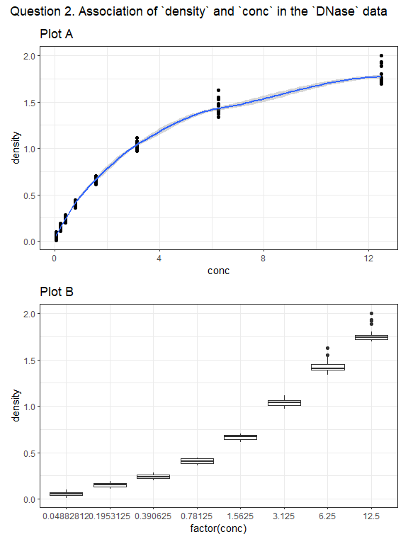

431 Lab 01
================
Due **2021-09-06** at 9 PM \| Last Edited 2021-08-12 11:03:59

# Loading Packages

``` r
library(patchwork); library(tidyverse)
```

# Learning Objectives

1.  Be comfortable interacting with R to gain additional information
    about an embedded data set.
2.  Describe a provided visualization, including commenting on its shape
    and the relationship observed.
3.  Contextualize the information presented in the figure, by using
    additional information about the data and building upon your
    description.
4.  Critically consider, and apply, the PPDAC approach as laid out by
    Spiegelhalter in the Introduction of *The Art of Statistics:
    Learning from Data*.

Lab 01 has 4 questions, all of which you need to complete by the
deadline posted on the [Course
Calendar](https://thomaselove.github.io/431/calendar.html).

# Question 1. Make a 30-second video to help us pronounce your name and learn something interesting about you

In this question, you will create and submit a short (30 seconds or
less, please) video of yourself (recording yourself using Zoom is a
solid approach.) In this film, we should be able to see your face
clearly and also hear you clearly, so make sure that is the case. The
resulting video should ideally be sent to us as an **.mp4** file.

## You will be doing two things in the video:

1.  First, say hello, and then state your name, loudly and clearly, so
    that the viewer can learn to pronounce it correctly. Please use both
    your given name and your family name. If you prefer to be called by
    a nickname, please specify that, too.

2.  Then, tell us something about you that we don’t know, and might be
    interested to learn. It can be anything at all. We’re hoping to get
    to know you a little better, and this can be something about your
    professional or private life, or whatever you feel you would like to
    share with us. We’re hoping to facilitate connections here.

### Some tips for the video…

-   Expect that your fellow students (as well as the Teaching Assistants
    and Dr. Love) will see your video before the semester is over, so
    keep that in mind as you decide what to tell us.
-   Do not worry about the quality of the video, or adding elaborate
    theatricality, props or scenery. If you’d like to do so, that’s
    fine, but just make sure that we can see you and hear what you are
    saying clearly.
-   We’re not kidding about the 30-second time limit. Please don’t let
    your video exceed 30 seconds.

# Question 2. Interpret Visualizations Built using R

We used R and the `tidyverse` (specifically the `ggplot2` part of the
`tidyverse`) to build two plots using the `DNase` data set from the
`datasets` package automatically loaded by R. Below, you’ll find the two
plots we built (labeled Plot A and Plot B) and the code we used to build
the plots and then display them in a single Figure with an appropriate
title (for which we used the `patchwork` package.)

Use the Help window in R to learn about the `DNase` data set, and in
particular, about the two variables displayed in the plots below, and
their scientific context.

Then write a paragraph (100-150 words is the appropriate length) which
explains what the Figure’s two plots indicate about the relationship
between the two variables, and (more generally) what you have learned
about the data (or science) from the Figure. Be sure to discuss how the
two plots work together specifically addressing the question of what you
can learn things from Plot A that you can’t learn from Plot B and vice
versa.

## Code for Plot A

``` r
plotA <- ggplot(DNase, aes(x = conc, y = density)) +
    geom_point() +
    geom_smooth(method = "loess", formula = y ~ x) +
    theme_bw() +
    labs(title = "Plot A")
```

## Code for Plot B

``` r
plotB <- ggplot(DNase, aes(x = factor(conc), y = density)) +
    geom_boxplot() +
    theme_bw() +
    labs(title = "Plot B")
```

## Code to combine Plots A and B into one Figure and display the result

``` r
plotA / plotB + 
    plot_annotation(
        title = "Question 2. Association of `density` and `conc` in the `DNase` data")
```

<!-- -->

# Question 3. React to the Introduction of *The Art of Statistics*

Read the introduction to David Spiegelhalter’s book *The Art of
Statistics*. Then write a short essay (of 100-150 words, please)
describing how the PPDAC problem solving cycle might be helpful to you
in the context of some “problem” you are interested in solving. Please
feel free to draw on your own experience solving problems in a
systematic way, and don’t feel obliged to write about a “problem” that
is related to biology or medicine or health or science. Anything you can
explain briefly and that you are interested in could work well here.

# Question 4. Connecting Spiegelhalter to Question 2

In Question 2 above, you’ve been given data (D) and a very rough
analysis (A), and from your own write-up have drawn some conclusions
(C). The PPDAC approach is notably a cycle, that after a conclusion we
return to another problem. Given what you’ve learned about the data,
what you’ve seen in the analysis, and the conclusions you’ve drawn in
Question 2, briefly (no more than 100 words) describe your thoughts as
to what the next cycle of the PPDAC approach for this study could be.
Please be sure to clearly specify what you see as the Problem, Plan,
Data, Analysis, and Conclusion while also highlighting how this builds
upon the results already presented. As with your responses to Questions
2 and 3, this essay should also be written as a paragraph, using clear
and complete English sentences and minimizing jargon.

# A Few Tips

You are welcome to discuss Lab 01 with Professor Love, the teaching
assistants or your colleagues, but your answer must be prepared by you
alone. Don’t be afraid to ask questions including during [TA office
hours](https://thomaselove.github.io/431/contact.html) or after class
with Dr. Love.

# Submitting the Lab

Eventually, you will:

-   create an `.mp4` video file for part 1
-   build a single Word or PDF or HTML document containing your
    responses to Questions 2-4 (please include your full name in the
    body of the document and clearly indicate which part of your
    response refers to each Question, ideally with headers like
    “Question 2.”)

The essays and the video should be submitted (the system will let you
upload each file) to the Lab 01 section in the [Assignments folder in
Canvas](http://canvas.case.edu) by the deadline.

# Grading

We will summarize some of the more interesting responses to Questions
2-4 after the Lab has been graded.

-   This Lab will be graded on a scale from 0-100, and students will
    receive 25 points for successful completion of each of the four
    questions.
-   Note that the teaching assistants will review your responses to
    Questions 2-4 carefully to assess clarity of writing, attention to
    detail, and adherence to grammatical and syntax requirements, but we
    will not grade Lab 01 with those elements in mind. (Spelling,
    grammar, syntax and the rest will matter for grading purposes in all
    other assignments this term.)
